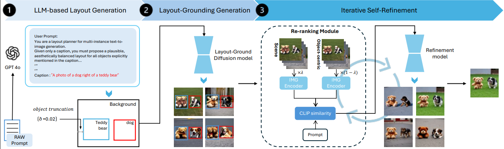
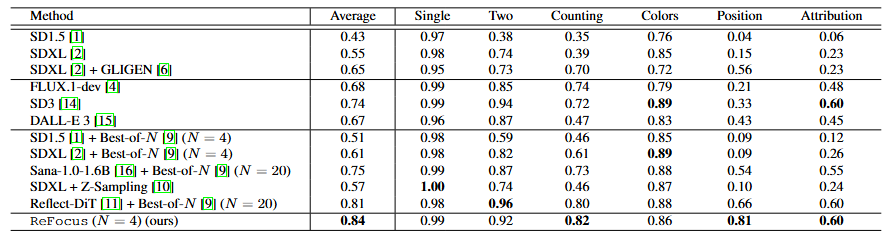
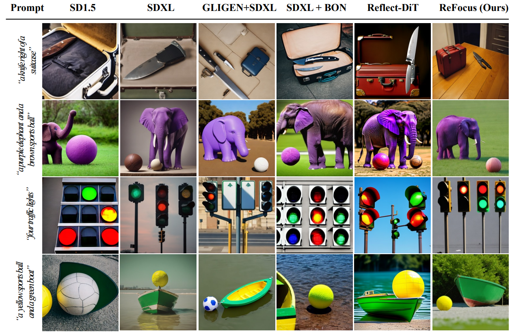

<!-- Top qualitative slider (place this ABOVE Abstract) -->
<div id="qual-carousel" class="carousel results-carousel">
  <div class="item-1">
    <figure class="result-figure">
      
      <figcaption class="result-caption">
        <span class="caption-label">Caption:</span> “a photo of a hybrid between a bee and a rabbit”
      </figcaption>
    </figure>
  </div>

  <div class="item-2">
    <figure class="result-figure">
      
      <figcaption class="result-caption">
        <span class="caption-label">Caption:</span> “Pikachu is under a tree, digital art”
      </figcaption>
    </figure>
  </div>

  <div class="item-3">
    <figure class="result-figure">
      
      <figcaption class="result-caption">
        <span class="caption-label">Caption:</span> “A dog / bird / helmet / backpack is on the grass”
      </figcaption>
    </figure>
  </div>

  <div class="item-4">
    <figure class="result-figure">
      
      <figcaption class="result-caption">
        <span class="caption-label">Caption:</span> “superman / monkey / Homer Simpson / is scratching its head”
      </figcaption>
    </figure>
  </div>

  <div class="item-5">
    <figure class="result-figure">
      
      <figcaption class="result-caption">
        <span class="caption-label">Caption:</span> “A vibrant colorful bird sitting on tree branch”
      </figcaption>
    </figure>
  </div>

  <div class="item-6">
    <figure class="result-figure">
      
      <figcaption class="result-caption">
        <span class="caption-label">Caption:</span> “The beautiful scenery of a clam village near the sea”
      </figcaption>
    </figure>
  </div>
</div>


<h2 style="text-align:center;">Abstract</h2>

Despite their impressive realism, modern text-to-image models still struggle with compositionality, often failing to render accurate object counts, attributes, and spatial relations. To address this challenge, we present a training-free framework that combines an object-centric approach with self-refinement to improve layout faithfulness while preserving aesthetic quality. Specifically, we leverage large language models (LLMs) to synthesize explicit layouts from input prompts, and we inject these layouts into the image generation process, where a object-centric vision-language model (VLM) judge reranks multiple candidates to select the most prompt-aligned outcome iteratively. By unifying explicit layout-grounding with self-refine-based inference-time scaling, our framework achieves stronger scene alignment with prompts compared to recent text-to-image models.


<h2 style="text-align:center;">Method</h2>

|  |


ReFocus is a training-free framework for generating high-fidelity images from complex compositional prompts while preserving object counts, attributes, and spatial relations. It combines explicit layout grounding with inference-time scaling, so users can obtain prompt-faithful results without manual trial-and-error.

First, an LLM parses the prompt into an explicit layout 𝐿 consisting of object labels and normalized bounding boxes. To avoid degenerate layouts that hurt diffusion generation (e.g., heavy overlaps/occlusions), the method applies simple constraints such as slightly shrinking boxes and preventing full overlaps, providing robust spatial guidance for the next stage.

Next, a layout-conditioned diffusion model generates multiple drafts from independent noise seeds. ReFocus then performs iterative self-refinement: it re-ranks candidates using a hybrid score that mixes scene-level CLIP alignment with object-level CLIP computed on crops defined by the layout, keeps top candidates, and applies a lightweight refinement step (low denoising strength). Repeating re-ranking and refinement progressively improves realism while maintaining compositional correctness.


<h2 style="text-align:center;">Experimental Results</h2>

<p align="center">
  
</p>

<p align="center">
  
</p>


## Citation
```
@article{ji2025compositional,
  title={Compositional Image Synthesis with Inference-Time Scaling},
  author={Ji, Minsuk and Lee, Sanghyeok and Ahn, Namhyuk},
  journal={arXiv preprint arXiv:2510.24133},
  year={2025}
}
```
